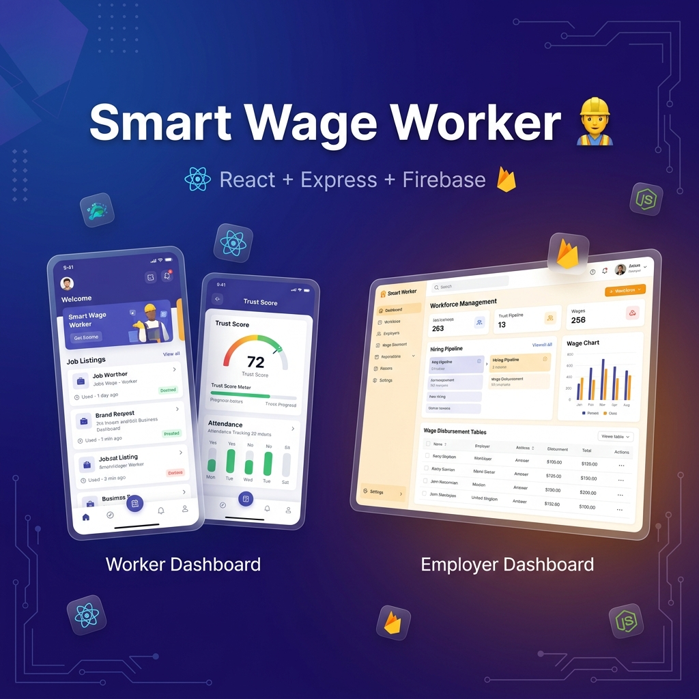
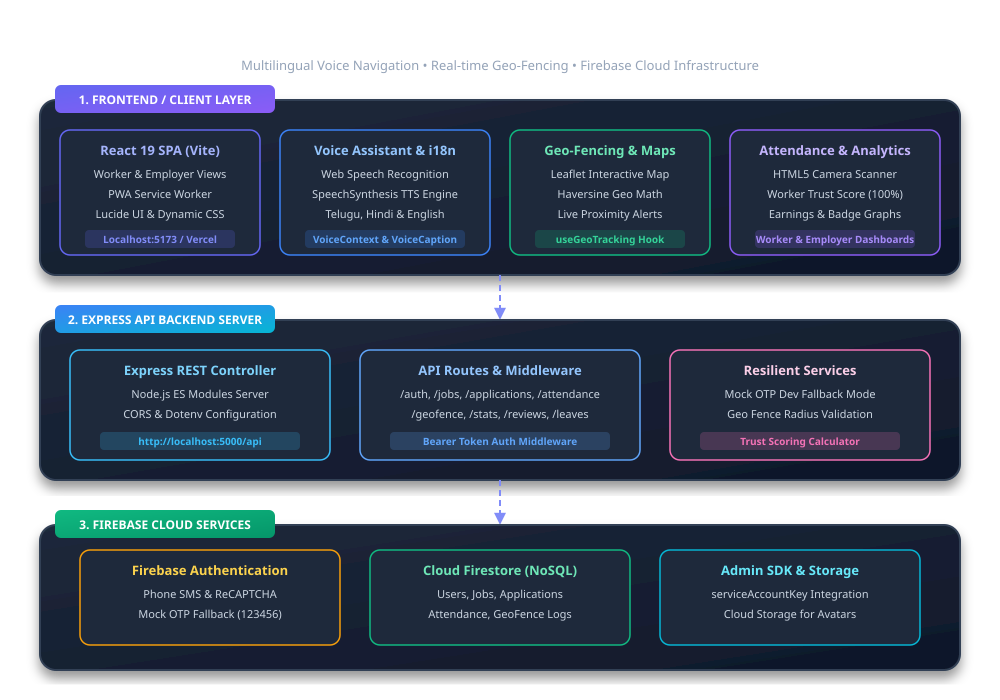

<p align="center">
  
</p>

<div align="center">

# 👷 Smart Wage Worker

### AI-Based Daily Workforce Management Platform

**Empowering Rural Workforce through Transparency, Trust, Accessibility, and AI**

<p>


</p>

**React • Express.js • Firebase • Firestore • AI • Voice Assistant • GPS Tracking • Progressive Web App**

</div>

---

# 📖 Table of Contents

- Overview
- Live Demo
- Demo Credentials
- Key Features
- System Architecture
- Technology Stack
- Project Workflow
- Folder Structure
- REST APIs
- Database Design
- Security
- Progressive Web App
- Installation
- Deployment
- Engineering Practices
- Roadmap
- Future Improvements
- Contributing
- Author
- License

---

# 📖 Overview

Smart Wage Worker is a modern full-stack workforce management platform designed to connect **daily-wage workers** and **employers** through a secure, AI-powered, and accessibility-first ecosystem.

The platform focuses on solving real-world challenges faced by rural workers by integrating:

- 🎤 Multilingual Voice Assistant
- 📍 GPS Attendance
- ⭐ Dynamic Trust Score
- 📱 QR Worker Profiles
- 📊 Analytics Dashboard
- 🗺️ Live Worker Tracking
- 🔒 Secure Firebase Authentication
- 🌐 Progressive Web Application

---

# 🎯 Problem Statement

Millions of daily-wage workers still depend on manual hiring processes with little transparency.

Common challenges include:

- Fake worker profiles
- Attendance fraud
- Lack of trust
- Language barriers
- Limited digital literacy
- No centralized workforce management

Smart Wage Worker addresses these issues through AI-assisted workforce management.

---

# 🚀 Live Demo

### 🌐 Production Website

https://smart-wage.web.app

---

# 🔑 Demo Credentials

| Role | Mobile | OTP |
|------|----------|----------|
| Worker | 1234567890 | 123456 |
| Employer | 9876543210 | 123456 |

---


# 🌟 Key Features

## 👷 Worker Portal

- Secure OTP Login
- Nearby Job Discovery
- Job Applications
- Attendance Management
- Leave Requests
- QR Worker Identity
- GPS Location Tracking
- Trust Score Dashboard
- Voice Assistant
- Profile Management

---

## 🏢 Employer Portal

- Create Jobs
- Workforce Management
- Worker Tracking
- Attendance Monitoring
- Analytics Dashboard
- Trust Score Analysis
- Hiring Pipeline
- Workforce Insights

---

## 🤖 AI & Accessibility

- Multilingual Voice Assistant
- Voice Guided Navigation
- Voice Job Posting
- Smart Workforce Insights
- Accessibility-first Design
- Future AI Job Recommendations

---

# 🏗️ System Architecture

<p align="center">

</p>

Detailed architecture documentation:

```
src/assets/ARCHITECTURE.md
```

---

# ⚙️ Technology Stack

| Category | Technologies |
|------------|------------------------------------------------|
| Frontend | React 19, Vite, Tailwind CSS |
| State Management | React Context API |
| Backend | Node.js, Express.js |
| Authentication | Firebase Authentication |
| Database | Cloud Firestore |
| Storage | Firebase Storage |
| Backend SDK | Firebase Admin SDK |
| Maps | React Leaflet |
| Charts | Recharts |
| Internationalization | i18next |
| Icons | Lucide React |
| Deployment | Firebase Hosting |
| Version Control | Git, GitHub |

---

# 🔄 Application Workflow

```
Worker Login
        │
        ▼
Firebase Authentication
        │
        ▼
Backend Verification
        │
        ▼
Worker Dashboard
        │
        ▼
Browse Jobs
        │
        ▼
Apply
        │
        ▼
Employer Dashboard
        │
        ▼
Attendance
        │
        ▼
Trust Score Update
        │
        ▼
Analytics Dashboard
```

---

# 🏛️ Backend Architecture

```
backend

├── config
├── controllers
├── middleware
├── routes
├── services
├── utils
└── server.js
```

---

# 📂 Frontend Structure

```
src

├── assets
├── components
├── contexts
├── hooks
├── pages
├── services
├── utils
└── App.jsx
```

---

# 📡 REST APIs

| Method | Endpoint | Description |
|--------|---------------------------|------------------------------|
| GET | /api/health | Server Health |
| POST | /api/auth/session | Authenticate User |
| GET | /api/jobs | Fetch Jobs |
| POST | /api/jobs | Create Job |
| GET | /api/users/:id/stats | Worker Dashboard |
| POST | /api/attendance | Mark Attendance |

---

# 🗄️ Database Design

```
Users
│
├── Worker
├── Employer
│
Jobs
│
Applications
│
Attendance
│
Trust Score
│
Reviews
```

---

# 🔒 Security

- Firebase Authentication
- OTP Verification
- Firebase Admin SDK
- Firestore Security Rules
- Protected REST APIs
- Role Based Access Control (RBAC)
- Input Validation
- Secure API Sessions

---

# 📱 Progressive Web Application

- Offline Support
- Installable Application
- Service Worker
- Web Manifest
- Mobile Optimized

---

# 📊 Project Status

| Module | Status |
|---------|---------|
| React Frontend | ✅ |
| Express Backend | ✅ |
| Firebase Authentication | ✅ |
| Firestore | ✅ |
| Firebase Admin SDK | ✅ |
| Attendance | ✅ |
| QR Profiles | ✅ |
| GPS Tracking | ✅ |
| Geo-Fencing | ✅ |
| Analytics Dashboard | ✅ |
| Voice Assistant | ✅ |
| Trust Score | ✅ |
| Progressive Web App | ✅ |
| Production Deployment | ✅ |
| ESLint | ✅ Zero Errors & Warnings |

---

# 💻 Local Installation

Clone repository

```bash
git clone https://github.com/sangemsudhakar8-alt/smart-wage-worker.git
```

Install dependencies

```bash
npm install
```

Run frontend

```bash
npm run dev
```

Run backend

```bash
cd backend
npm install
npm start
```

---

# 🚀 Production Deployment

Build

```bash
npm run build
```

Deploy

```bash
firebase deploy
```

---

# 🧪 Engineering Practices

- Component-Based Architecture
- Service Layer Pattern
- RESTful API Design
- Context API State Management
- Firebase Admin SDK
- Progressive Web App
- Responsive Design
- Feature Branch Workflow
- Git Version Control
- ESLint Code Quality

---

# 📈 Performance & Code Quality

- ✅ Zero ESLint Errors
- ✅ Zero ESLint Warnings
- ✅ Production Build Verified
- ✅ Backend API Tested
- ✅ Firebase Security Rules
- ✅ Modular Architecture
- ✅ Responsive Design

---

# 🗺️ Roadmap

## Completed

- [x] OTP Authentication
- [x] Attendance
- [x] GPS Tracking
- [x] Trust Score
- [x] Voice Assistant
- [x] QR Worker Profile
- [x] Analytics Dashboard
- [x] Geo-Fencing
- [x] Progressive Web App

## Upcoming

- [ ] Real-Time Chat
- [ ] Push Notifications
- [ ] AI Job Recommendation
- [ ] Payroll Automation
- [ ] Admin Dashboard
- [ ] Predictive Workforce Analytics

---

# 🤝 Contributing

Contributions are welcome.

1. Fork this repository

2. Create a feature branch

```
git checkout -b feature-name
```

3. Commit changes

```
git commit -m "Add feature"
```

4. Push

```
git push origin feature-name
```

5. Open a Pull Request

---

# 👨‍💻 Author

**Sangam Sudhakar**

📧 Email

```
sangemsudhakar8@gmail.com
```

💼 LinkedIn

https://www.linkedin.com/in/sangam-sudhakar-52590538a/

💻 GitHub

https://github.com/sangemsudhakar8-alt

---

# 📄 License

This project is licensed under the MIT License.

---

<div align="center">

### ⭐ If you found this project helpful, consider giving it a Star!

Made with ❤️ using React, Express.js, Firebase, and AI.

</div>
